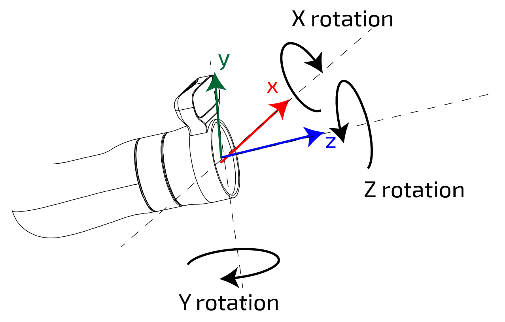

# Eddie Ros

A ROS 2 package for control and communication with Eddie, the robot.

## Requirements

Setup the robot by following the steps in [this file](robot_setup.md).

## Run

Don't forget to source the workspace before running the interface:

```bash
source install/setup.bash
```

To run the eddie_ros interface, use:

```bash
ros2 launch eddie_ros eddie.launch.py ethernet_if:=<eth interface> arm_select:=<controlled arm(s)>
```

Set the ethernet interface with the parameter `ethernet_if`. Use `ip a` to find the correct interface name. For more information on the connection to the robot, refer to the [robot setup documentation](robot_setup.md#check-connection).

Set the controlled arm(s) with `arm_select` to either `left`, `right` or `both`. This argument is required.

## Run simulation

To run the simulation interface, use:

```bash
ros2 launch eddie_ros eddie.launch.py use_sim:=true arm_select:=<controlled arm(s)>
```

Set the controlled arm(s) with `arm_select` to either `left`, `right` or `both`. This argument is required.

## ROS2 Actions

You can send goals to the robot using ROS2 actions depending on the selected arm(s).

- `left_arm/arm_control` and `right_arm/arm_control` of type `eddie_ros/action/ArmControl` for controlling the arm's target pose.
- `left_arm/gripper_control` and `right_arm/gripper_control` of type `eddie_ros/action/GripperControl` for controlling the gripper's position, velocity, and force.

For example, to move the right arm to a target pose (here, 10 cm in the z direction):

```bash
ros2 action send_goal right_arm/arm_control eddie_ros/action/ArmControl '{ target_pose: { position: {x: 0.0, y: 0.0, z: 0.1} } }'
```

To control the gripper of the right arm:

```bash
ros2 action send_goal right_arm/gripper_control eddie_ros/action/GripperControl '{ target_position: 50.0, velocity: 20.0, force: 20.0 }'
```

Check out the [action definitions](action) for more details on how to define goals.



The image above shows the axis reference frame for the Kinova Manipulator end-effector coordinate system. Also see the [manual](https://github.com/Robots4Sustainability/documentation/blob/main/manuals/EN-UG-014-Gen3-Ultra-lightweight-user-guide-r10.0.pdf) for more information.

## View robot in RViz

### Using real robot

Run the eddie_ros interface:

```bash
ros2 launch eddie_ros eddie.launch.py ethernet_if:=<eth interface> arm_select:=<controlled arm(s)>
```

You can specify if you want to show RViz on launch by adding the argument `show_rviz:=true`:

```bash
ros2 launch eddie_ros eddie.launch.py ethernet_if:=<eth interface> arm_select:=<controlled arm(s)> show_rviz:=true
```

### Using simulation

Run the simulation interface:

```bash
ros2 launch eddie_ros eddie.launch.py use_sim:=true arm_select:=<controlled arm(s)>
```

You can specify if you want to show RViz on launch by adding the argument `show_rviz:=true`:

```bash
ros2 launch eddie_ros eddie.launch.py use_sim:=true arm_select:=<controlled arm(s)> show_rviz:=true
```

## Plotting cartesian error with [Cartesian Error Visualizer](https://github.com/Robots4Sustainability/cart-error-visualizer)

You can visualize the Cartesian error of the end-effectors with [Cartesian Error Visualizer](https://github.com/Robots4Sustainability/cart-error-visualizer).
Follow the instructions in the repository on how to install and run the visualizer.

### Plotting with `rqt_plot` (not recommended)

You can also visualize the Cartesian error of the end-effectors with `rqt_plot`:

First, make sure to run the `eddie_ros_interface` node as described above.

Then, in a new terminal, source your ROS2 workspace and run:

```bash
rqt
```

Select `Plugins` -> `Visualization` -> `Plot` from the menu or directly run the `Plot` plugin standalone:

```bash
rqt -s Plot
```

Then, enter the topics to plot, for example:

- Right arm position error (X, Y, Z):

    ```plaintext
    /right_arm/cartesian_error/linear/x,/right_arm/cartesian_error/linear/y,/right_arm/cartesian_error/linear/z
    ```

- Right arm rotation error (X, Y, Z):

    ```plaintext
    /right_arm/cartesian_error/angular/x,/right_arm/cartesian_error/angular/y,/right_arm/cartesian_error/angular/z
    ```
